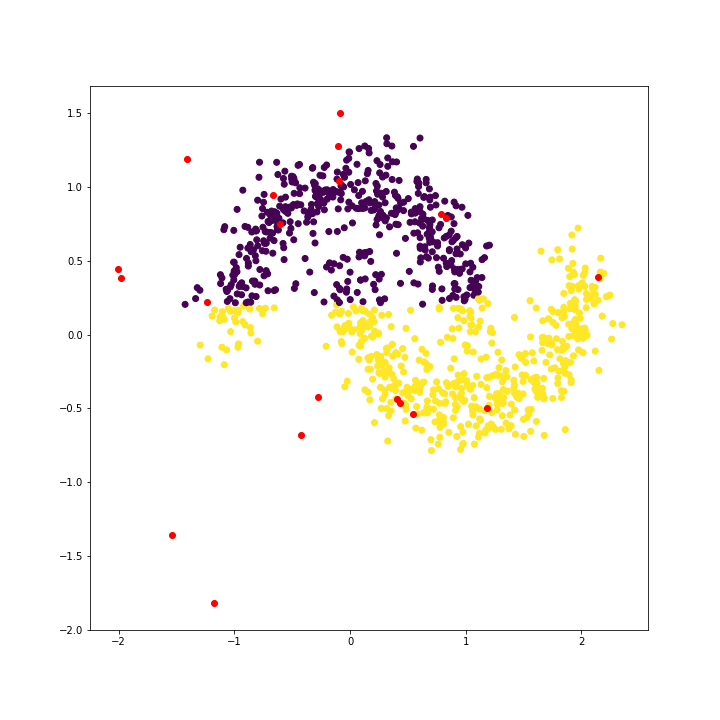

# RBF
Some simple rbf layers and models

TO DO

general
	1) Explain RBF in this readme

rbf_layer.py
	1) Add support for more kernels
	2) Clean up/simplify code
	3) Drop support for multidimensional input -- nothing is really gained and it makes the code harder to understand.

shallow_rbf.ipynb
	1) Upload example and Cleanup

deep_rbf_rejection.py
	1) Upload completed version
